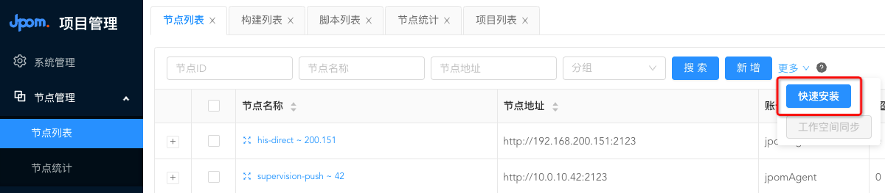
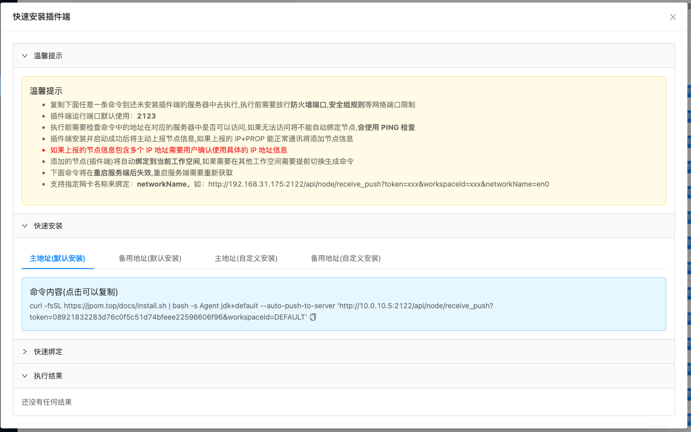
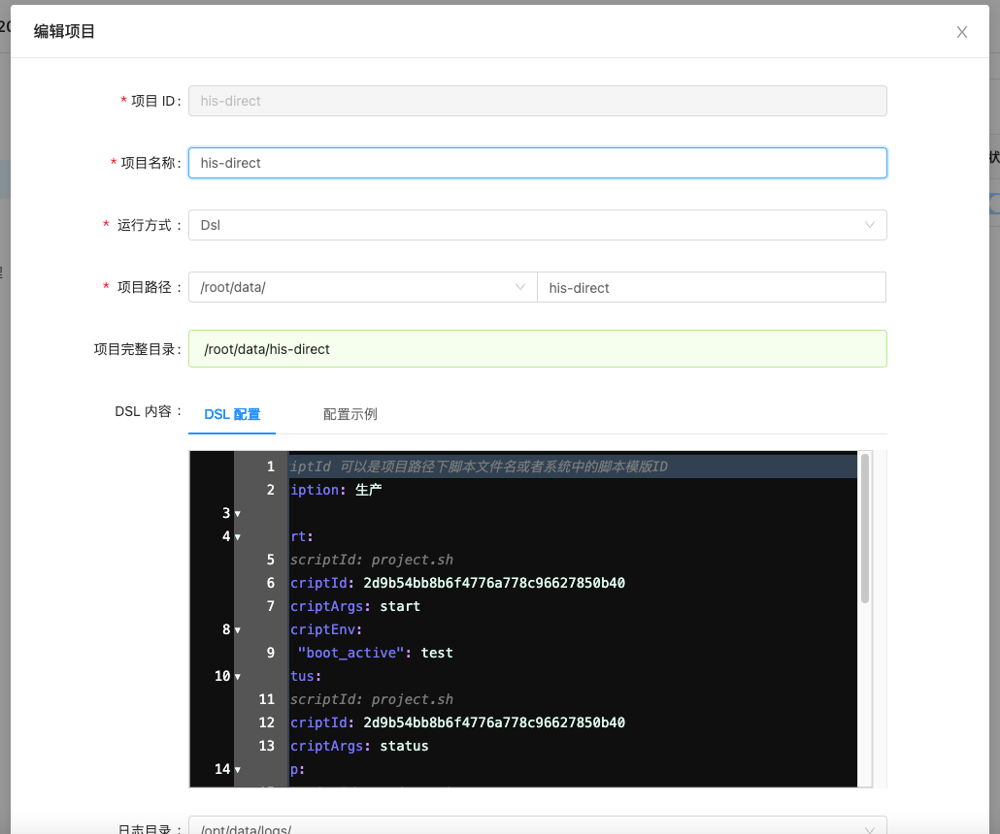
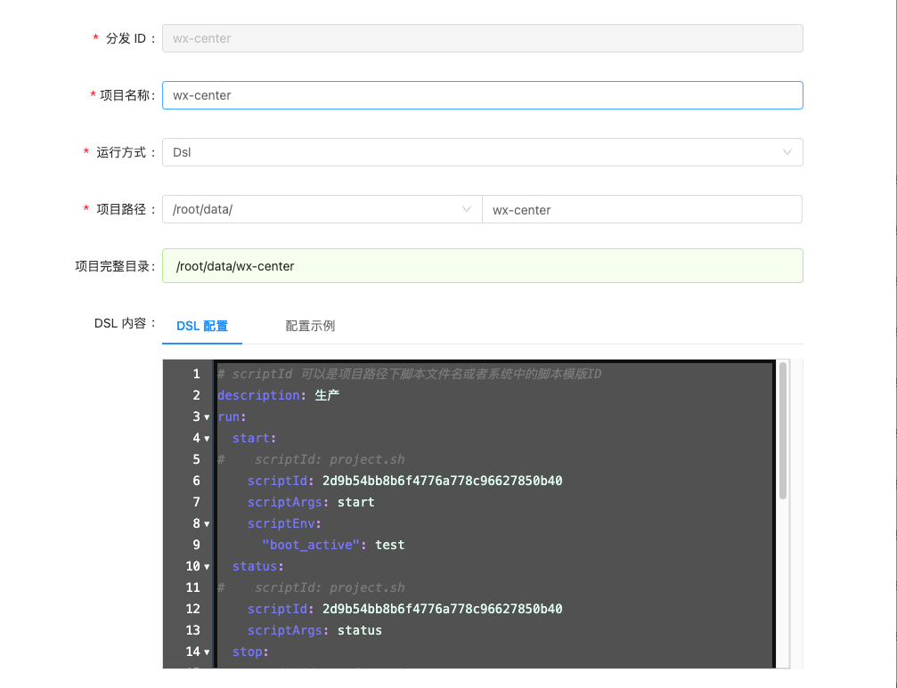
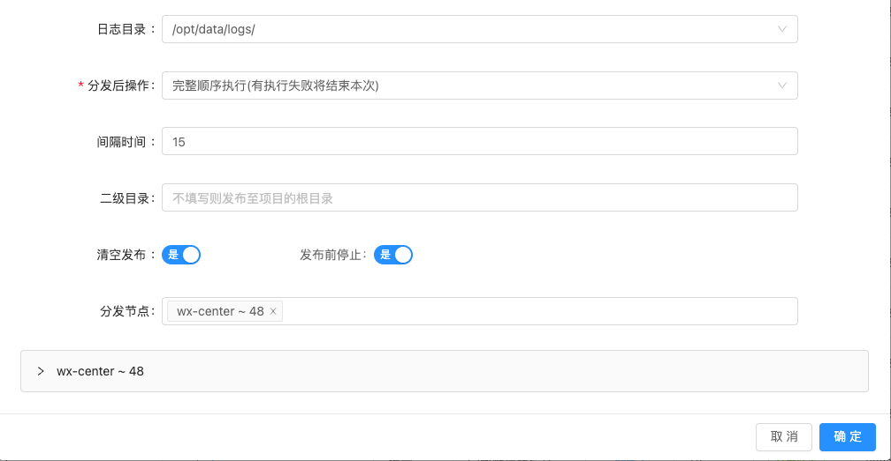
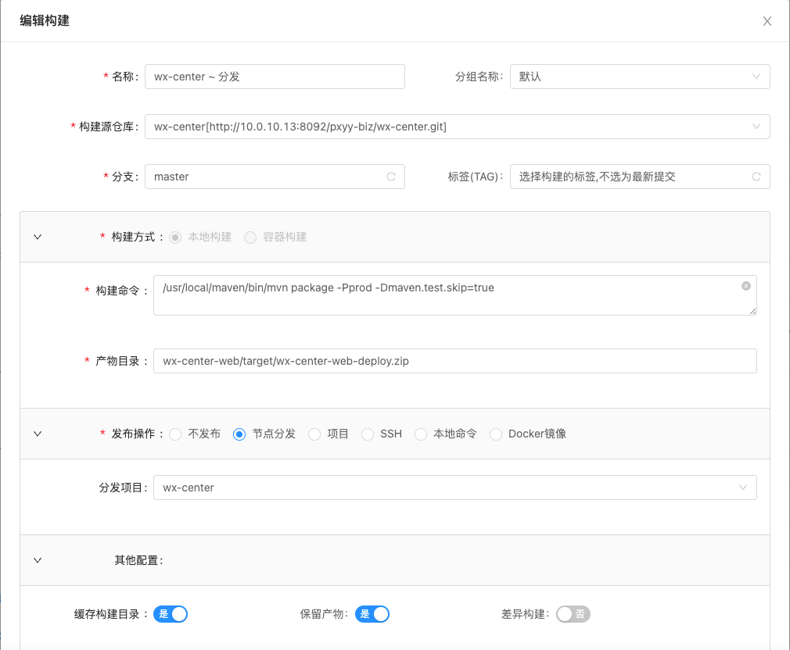

# JPOM 安装

### 官网 - [https://jpom.top/pages/readme](https://jpom.top/pages/readme)

* 目前生产环境使用的版本号为：2.10.6 ，[修改过源代码](files/DefaultWebhookPluginImpl.java)、为监控增加了支持推送钉钉
* 如果后续升级版本，请关注此问题
* 此文档所有相关配置均对应生产环境

## 现有服务分布情况

| 项目  | 服务器1 | 服务器2 |
|-----|------|------|
|supervision-push     |10.0.10.42      |      |
|multi_function     |10.0.10.14      |      |
|operation_client     |10.0.10.8       |      |
|contract_center     |10.0.10.15      |      |
|notify_center     |10.0.10.6      |      |
|pay_center     |10.0.10.33      |      |
|doctor_client     |10.0.10.30      |10.0.10.31      |
|medical     |10.0.10.19      |10.0.10.18      |
|medical_core     |10.0.10.7      |10.0.10.16      |
|order_center     |10.0.10.43      |10.0.10.32      |
|user_center     |10.0.10.44      |10.0.10.46      |
|wx_center     |10.0.10.48      |      |
|bottom     |10.0.10.3      |10.0.10.11      |

## 1. jpom安装

### 1.1 [安装server端]
* 服务器：10.0.10.5
* 目录： /opt/jpom

### 1.2 [添加节点])
* 操作路径：节点管理-节点列表-更多-快速安装
* 复制命令，然后在需要部署服务的VPC上执行

### 1.3 [添加项目]
* 操作路径：选择节点-项目管理-项目列表-新增
* 填写下图参数
* DSL配置文件：[查看dsl](files/project-dsl.sh)

### 1.4 [创建分发]
* 操作路径：项目管理-分发列表-创建分发项目
* 填写下图参数
* DSL配置文件：[查看dsl](files/distribution-dsl.sh)

### 1.5 [新增仓库]
* 操作路径：在线构建-仓库信息-新增
* 配置好GitLab仓库地址(单个项目)，也可以使用AccessToken批量导入

### 1.6 [新增构建]
* 操作路径：在线构建-构建列表-新增
* 填写下图参数

